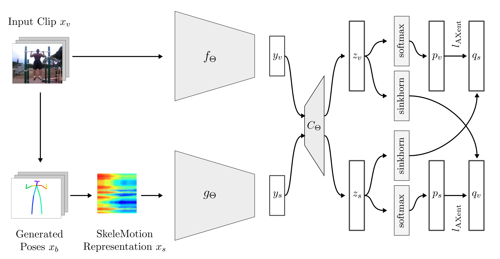

# Pose-based Contrastive Learning for Domain Agnostic Activity Representations

This repository will contain the original implementation of Pose-based High Level View Contrasting (P-HLVC).
This technique applies contrastive clustering on latent space representations generated by a two stream network
applied to augmented video views and body pose motion.



## Research Focus
HLVC aims at improving the action recognition performance on small cross-domain datasets by learning semantic video representations
based on body movements on very large pretraining datasets. Learning these pose-motion based semantic representations
facilitates the learning process of human actions in a domain generalizable manner (e.g. from synthetic to real data). Labelling large amounts of data
proves to be increasingly difficult with the ever-growing size of pre-training datasets and P-HLVC does not require any human
annotated labels on the pre-training dataset.

P-HLVC is closely related to the topics of unsupervised and self-supervised learning as well as Domain Generalization.

## Cite

If you are interested in this work and want to reference it in a work of your own, you can cite this paper:
Paper: [Pose-based Contrastive Learning for Domain Agnostic Activity Representations](https://openaccess.thecvf.com/content/CVPR2022W/RoSe/papers/Schneider_Pose-Based_Contrastive_Learning_for_Domain_Agnostic_Activity_Representations_CVPRW_2022_paper.pdf)
[Supplementary](https://openaccess.thecvf.com/content/CVPR2022W/RoSe/supplemental/Schneider_Pose-Based_Contrastive_Learning_CVPRW_2022_supplemental.pdf)

```
@InProceedings{Schneider_2022_CVPR,
    author    = {Schneider, David and Sarfraz, Saquib and Roitberg, Alina and Stiefelhagen, Rainer},
    title     = {Pose-Based Contrastive Learning for Domain Agnostic Activity Representations},
    booktitle = {Proceedings of the IEEE/CVF Conference on Computer Vision and Pattern Recognition (CVPR) Workshops},
    month     = {June},
    year      = {2022},
    pages     = {3433-3443}
}
```
